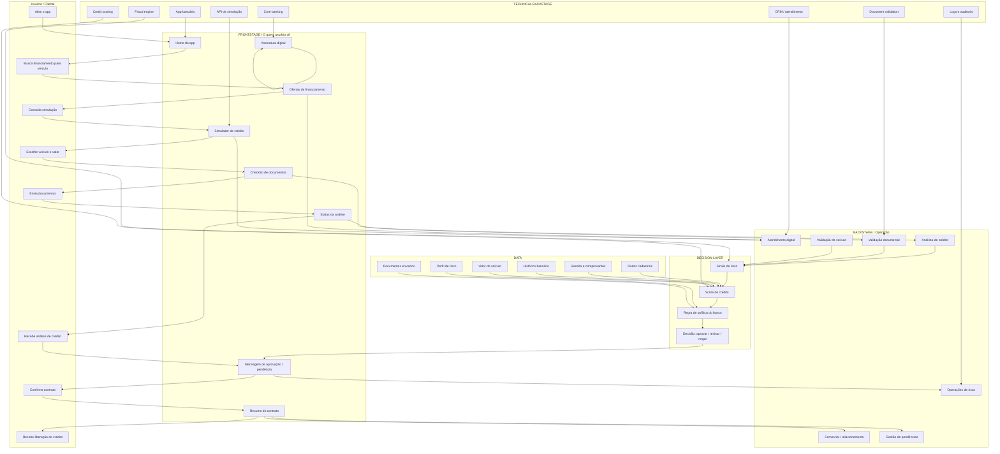

# 06. Blueprint visual do serviço: financiamento de veículo no app bancário

## Contexto do cenário
Um cliente do banco acessa o app para financiar a compra de um veículo. O objetivo é facilitar a simulação, a análise de crédito e a contratação, sem gerar fricção desnecessária e sem comprometer os controles de risco.

## Blueprint visual

## Interpretação do blueprint

### Camada de usuário
O cliente interage diretamente com o app para:

- encontrar a melhor opção de financiamento;
- simular parcelas;
- escolher veículo;
- enviar documentação;
- acompanhar status da análise;
- assinar contrato.

### Camada de interface / frontstage
O app precisa ser claro, rápido e confiável. Ele transmite:

- proposta de crédito;
- explicação do processo;
- documentação necessária;
- status atualizado da análise;
- mensagens de aprovação, pendência ou negativa.

### Camada de operação / backstage
Por trás do app, o banco precisa executar:

- atendimento digital;
- análise de crédito;
- validação documental;
- validação do veículo;
- revisão do risco;
- gestão de pendências.

### Camada de decisão
A decisão do banco depende de:

- sinais de risco;
- score de crédito;
- políticas internas;
- histórico do cliente;
- valor e perfil do veículo.

### Camada de dados
O processo precisa integrar:

- dados cadastrais;
- receitas e comprovantes;
- histórico bancário;
- valor do veículo;
- documentos enviados;
- nível de risco do cliente.

### Camada técnica
Os sistemas podem incluir:

- app bancário;
- API de simulação;
- fraud engine;
- credit scoring;
- validadores de documento;
- core banking;
- CRM;
- logs e auditoria.

## Pontos de fricção esperados
- necessidade de enviar muitos documentos;
- dúvida sobre o motivo da pendência;
- demora na análise;
- comunicação genérica sobre aprovação ou recusa;
- falta de clareza sobre o status do contrato.

## Oportunidades de melhoria de serviço
- explicar melhor o motivo da solicitação documental;
- reduzir etapas repetitivas;
- oferecer status claro e progressivo;
- mostrar qual parte do processo está em análise;
- permitir revisão de pendências sem perder contexto;
- adaptar a fricção ao nível de risco do cliente;
- assegurar que o usuário entenda a decisão sem se sentir rejeitado.

## Conclusão
Esse blueprint mostra que, em um app de banco para financiamento de veículo, o problema não está somente em aprovar ou negar o crédito. O verdadeiro desafio está em conectar a experiência do cliente, a operação do banco, as regras de risco e os sistemas técnicos em uma jornada coerente, compreensível e confiável.
