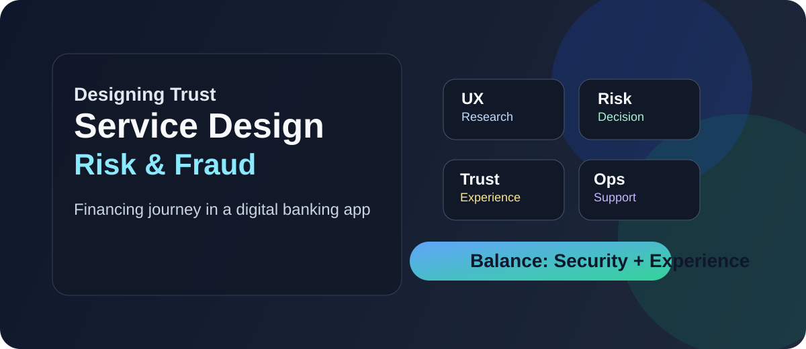

# Presentation Pack

  

Este diretório reúne os materiais visuais e narrativos do case para apresentação em entrevista, portfólio ou pitch.

## Estrutura

- [01-capa.md](01-capa.md)
- [02-resumo-executivo.md](02-resumo-executivo.md)
- [03-storytelling.md](03-storytelling.md)
- [04-slide-deck.md](04-slide-deck.md)
- [05-notes-entrevista.md](05-notes-entrevista.md)

## Objetivo
Apresentar o projeto de forma clara, profissional e convincente, com foco em:

- problema de serviço;
- jornada do cliente;
- risco e operação;
- experiência digital;
- proposta de redesign.

## Uso sugerido
- para entrevistas de emprego: usar a narrativa e os pontos-chave;
- para portfolio: usar a capa, o resumo executivo e a história do projeto;
- para pitch: usar o slide deck e os principais insights.
